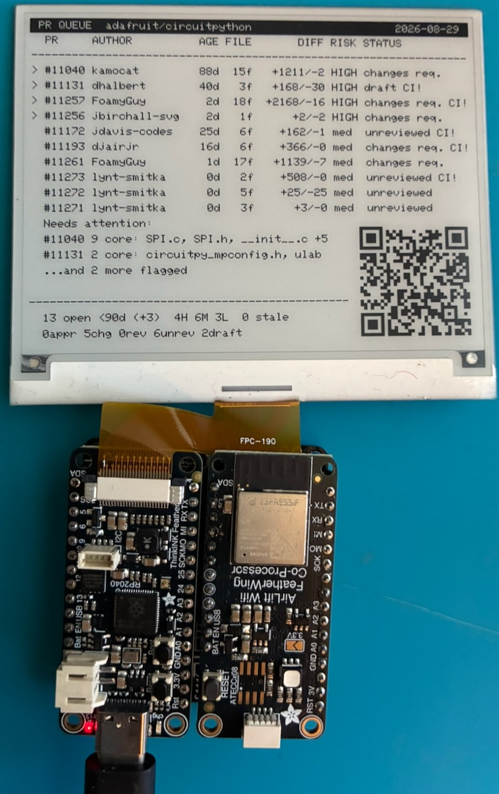

# eink-pr-queue



A Feather RP2040 ThinkInk and AirLift paint a GitHub pull request risk
dashboard onto 4.2 inch eInk via Adafruit IO.

## How it connects

```
  ┌──────────────────────────────────────────────────────────────────┐
  │  GITHUB ACTIONS          cron "0 * * * *"  (hourly, on the hour) │
  │  .github/workflows/      also: workflow_dispatch (manual)        │
  │    update-panel.yml             repository_dispatch(pr-changed)  │
  │                                                                  │
  │  collect.py ──▶ score.py ──▶ render.py ──▶ push.py               │
  │   gh pr list    5 concerns   66x21 text    HTTPS POST            │
  │   --since-days  worst-of-5   worst-first   skip if unchanged     │
  │       90                                                         │
  │                                                                  │
  │  secret: AIO_WEBHOOK_URL   (a capability URL, not the account    │
  │                             key, so the runner holds no AIO_KEY) │
  └───────────────────────────────────────────────────┬──────────────┘
                                                      │ {"value": "..."}
                                                      ▼
                        https://io.adafruit.com/api/v2/webhooks/feed/<token>
                                                      │
                                           ┌──────────┴──────────┐
                                           │  feed: pr-queue     │
                                           │  history: OFF       │
                                           │  rate limit: 2/min  │
                                           └──────────┬──────────┘
                                                      │ MQTT/TLS :8883
                                                      │ <user>/f/pr-queue
                                                      │ + /get replay on boot
                                                      ▼
  ┌──────────────────────────────────────────────────────────────────┐
  │  FEATHER DOUBLER                                                 │
  │   Feather RP2040 ThinkInk  ◀── header SPI ──▶  AirLift (ESP32)   │
  │   CircuitPython 10.3            CS=D13         nina-fw 3.3.0     │
  │                                 READY=D11                        │
  │                                 RESET=D12                        │
  │                                                                  │
  │   hash the payload: identical screen, no repaint                 │
  │   hold, never drop, inside the 180s refresh floor                │
  └──────────────┼───────────────────────────────────────────────────┘
                 │ onboard 24-pin ZIF, SPI0, a SEPARATE bus
                 ▼
        ┌─────────────────────────────┐
        │  4.2" 400x300 SSD1683       │
        │  #6381, FPC-190 ribbon      │
        │  66 cols x 21 rows          │
        │  8 to 11s full refresh      │
        └─────────────────────────────┘
```

The webhook is the way in and MQTT is the way out. The panel cannot receive an
inbound HTTP push, so it subscribes instead. Adafruit IO's outbound Actions
are not used.

## The one wiring rule

**The panel goes in the ThinkInk's own ZIF socket.** Wiring it to the header
via EyeSPI puts its RST and BUSY on D11 and D12, which is exactly where the
AirLift's READY and RESET live. In the ZIF socket the panel sits on SPI0 and
the radio has the header bus to itself, so the two never touch.

| | Bus | Pins |
|---|---|---|
| Panel | SPI0, onboard 24-pin ZIF | `EPD_SCK`/`EPD_MOSI` GPIO22/23, `EPD_CS`/`DC`/`RESET`/`BUSY` GPIO16-19 |
| AirLift | Feather header SPI | SCK/MOSI/MISO GPIO14/15/8, CS=D13, READY=D11, RESET=D12 |

D13 is also `board.LED`, so the red LED flickers on SPI traffic. Cosmetic.

## Producer

Pure stdlib Python plus the `gh` CLI. Nothing to install.

```sh
cd producer
DRY_RUN=1 ./update.sh adafruit/circuitpython --since-days 90   # render only
./update.sh adafruit/circuitpython --limit 200                 # render and push
```

| Step | Does | Judgment? |
|---|---|---|
| `collect.py` | `gh pr list` into `raw.json` | none, facts only |
| `score.py` | five concerns into `rows.json` | three of five, mechanically |
| `render.py` | the exact 66x21 panel text | layout only |
| `push.py` | POST to the feed webhook | none |

### What the scoring does and does not do

Each PR is scored on five concerns and takes the **worst, never the average**.
Three are mechanical. Two are not:

- **APIs / interfaces** always comes out `null`. Deciding whether a PR reuses
  the established convention needs the diff read against recently merged work
  in the same area. No regex does that.
- **Single problem** only reaches `med`, via a weak proxy (a diff fanning
  across many top-level trees).

Size and tested also cap at `med` on purpose: a big diff for a big well-scoped
problem is not a flag, and a missing test claim on a two-line change is barely
one. **High comes from core-path blast radius, or from a judgment a human or
model supplied.** To supply one, edit `rows.json`, set `concerns.apis` or
`concerns.single` to 0/1/2, and recompute:

```sh
./score.py .work/rows.json --rescore -o .work/rows.json
```

Core paths per repo live in `CORE_PATHS` in `score.py`. For an unlisted repo,
pass `--core-path py/ --core-path shared-bindings/` or the concern degrades to
a plain file count and says so.

### Feed setup, and the thing that will bite you

Create a feed, then **turn history OFF** (Feed > Feed Info > History).

| History | Max bytes per value |
|---|---|
| on | 1,024 |
| off | 524,288, per the feed's own history dialog |

Adafruit's two dialogs disagree on the off figure: the history dialog says
512KB (524288 bytes), the webhook dialog says 100 kilobytes. Either is ample
here. The number that actually matters is the 1,024 while history is ON,
because a full 21-row screen is 1.0 to 1.4KB and every push fails against it.

Nothing is lost by turning history off: only the newest value is ever drawn,
and MQTT `/get` returns it on demand. Then:

```sh
export AIO_WEBHOOK_URL="https://io.adafruit.com/api/v2/webhooks/feed/XXXXXXXX"
```

The token is in the URL, so no API key travels with the request. `push.py`
hashes the last payload and skips an identical push.

## Wire format

The payload is **the finished screen**, not data. All layout happens on the
host.

```
66 columns x 21 rows, newline separated, trailing spaces stripped
a line beginning with '~' is drawn white-on-black (the title bar)
```

66x21 is what 400x300 gives you with the `adafruit_epd` built-in 6x8 font,
using 396x294 of the panel. Doing it this way means every layout change is a
host-side edit with no reflash.

Row anatomy:

```
>*#10283 rianadon       492d  13f    +517/-1 HIGH changes req. CI!
||
|+-- '*' stale: no maintainer review past --stale-days (default 180)
+--- '>' overall risk High
```

## Notes from building it

**Mono, not 4-gray.** The `Adafruit_SSD1683_Grayscale4` class works and shading
each risk level a different tone was tried on real glass. It read badly: the
6x8 font is too fine for DARK and LIGHT to stay crisp. Mono also halves the
framebuf, 15KB instead of 30KB, and draws in 8.0s instead of 10.0s.

**adafruit_epd, not displayio.** The displayio SSD1683 path has a bug on panels
256px or wider: the core switches command 0x44 to 2-byte column addressing, but
on SSD168x 0x44 is byte-addressed, so the X window collapses to about 8px and
the rest is stale-RAM speckle. The framebuf path does not have it.

**RAM is not the constraint.** 67KB free of 264KB with every import loaded and
the framebuf allocated.

**The NeoPixel is the status display.** A wall panel cannot report for itself
without burning an 8 second refresh, so the LED carries state: amber
initialising or painting, red WiFi or MQTT down, blue connected, green idle
and current.

## Why this polls instead of using a webhook

The obvious design is a GitHub webhook firing straight into the Adafruit IO
feed. It is not available here, and the reason is worth writing down because
everyone asks.

**Repository webhooks require admin on the repo being watched.** This panel
watches `adafruit/circuitpython`, where a contributor typically has `push`
but `admin: false`. A pull request cannot add one either: webhooks live in
repo Settings, created via `POST /repos/{owner}/{repo}/hooks`, and are not
files in the tree.

That gate is general, and every automation vendor ships both sides of it.
Pipedream states the rule plainly in its own
[component README](https://github.com/PipedreamHQ/pipedream/blob/master/components/github/README.md):

> "The GitHub triggers in Pipedream enable you to get notified immediately
> via a webhook if you have admin rights on the repo you're watching [...]
> Otherwise you can still poll for updates at a regular interval for any
> other repo where you might not have admin rights."

So a service marked "(Instant)" creates a repo webhook and needs admin. The
plain variant polls with your OAuth token and needs nothing.

### What is actually available without admin

| Mechanism | No admin? | Push or poll |
|---|---|---|
| Repository webhooks | no | push |
| GitHub App install | no, needs org owner | push |
| PubSubHubbub (`github.com/hub`) | no, defunct | n/a |
| Atom feeds | no PR or issue feed exists | poll |
| Public events API | **yes** | poll |
| Actions triggered by a third-party repo | no | n/a |
| **Watch + email notifications** | **yes** | **genuine push** |

Only the last is real push with no permission. Anyone can Watch a public
repo, and GitHub's backend then emails you on PR activity. Routed to a
dedicated address and through a mail-to-webhook bridge, that is true push.
The costs are a hosted mail bridge and the fact that Watching a repo as busy
as CircuitPython is a firehose to filter.

A note on the events API, since it looks better than it is: it does carry
`PullRequestEvent` unauthenticated, and conditional requests with `If-None-Match`
return 304 without consuming rate limit, which makes continuous polling free.
But `x-poll-interval: 60` says how often you may ask, not how fresh the answer
is. [GitHub documents event latency as 30s to 6h](https://docs.github.com/en/rest/activity/events),
and the endpoint sends `cache-control: max-age=300`.

### Why no third-party bridge either

Make.com, IFTTT and Pipedream can all poll a repo you do not administer and
POST to the Adafruit IO webhook, with no admin anywhere. They were rejected
on merit, not availability:

- Make's free polling floor is 15 minutes. The Actions cron runs hourly and
  a PR queue does not move faster than that, so a bridge buys nothing for one
  more dependency.
- A bridge cannot replace the producer. It can report that a PR changed, but
  it cannot run the five-concern scoring or render 66x21 text, so the
  workflow still has to run. The bridge could only trigger it, which means
  storing a GitHub token in a third party to fire `repository_dispatch`.

### And it would not carry the data anyway

A `pull_request` event is about 35KB, of which the useful part is the PR
object plus the repository object. It reports `changed_files` as an integer
and contains no file paths. Core-path blast radius is what produces every
High rating in this dashboard, so a re-fetch against the API is required no
matter how the notification arrives.

Adafruit's own [PyPortal GitHub Stars Trophy](https://learn.adafruit.com/pyportal-github-stars-trophy)
guide reaches the same conclusion by a different route: to watch
`adafruit/circuitpython`, a repo the reader does not own, it polls the API
from the device every 60 seconds.

Against a panel with a 180 second minimum between refreshes, none of this is
visible at the glass.

## Verified end to end

Running unattended as of 2026-08-29. Boot log from the board, for comparison
if yours misbehaves:

```
init panel on onboard ZIF (SPI0)
init AirLift on header SPI
nina-fw 3.3.0
wifi: connecting to <ssid>
wifi ok, rssi -56
mqtt: connecting
mqtt connected, subscribed to <user>/f/pr-queue
rx 781 bytes
painting 781 bytes
refresh took 7.9s
idle
```

That `rx` arrived from the `/get` replay on connect, with no producer run
involved. It is what stops a board that boots between pushes from sitting
blank until the next one.

`payload-test.txt` is worth keeping on the board as an offline fixture, so
the panel can be re-tested with no network at all: read it, draw it.

## Libraries

```sh
circup install adafruit_esp32spi adafruit_connection_manager \
               adafruit_minimqtt adafruit_ticks neopixel
```

`adafruit_epd`, `adafruit_framebuf` and `adafruit_bus_device` ship with most
ThinkInk setups already.

## License

GPL-3.0-or-later. See [LICENSE](LICENSE).
